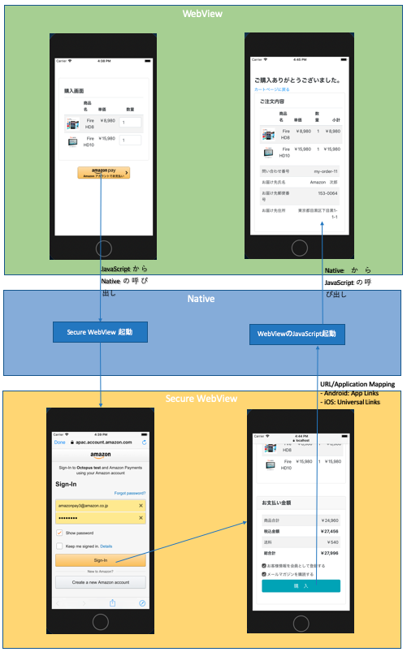

# Amazon Pay モバイル サンプルアプリについて
SmartPhone上でAmazon Payを使って商品を購入するアプリの、サンプル実装です。  
本サンプルアプリを参考にして様々なご実装のアプリにAmazon Payを簡単にカスタマイズして導入いただけるよう、アプリの構成は可能な限りシンプルに、また必要な技術要素を網羅して各々の技術の使い所・注意点をあわせて説明しております。

Amazon PayではSecurityのためWebViewがサポート対象となっていないため、Amazon Payに関するAmazon Payボタン表示・Amazon Payへのログイン・住所選択ウィジェット＆支払い方法選択ウィジェットの表示などは、サポート対象となっている下記のブラウザ技術を使っています。  
  * Android: Chrome Custom Tabs  
  * iOS: SFSafariViewController  

※ 本ドキュメント 及び サンプルアプリのコード内では、両方を合わせて「*Secure WebView*」と呼んでおります。  

本サンプルアプリのコードの大部分はHTML + CSS + JavaScriptで構成されており、通常のPC上での実装とほぼ同じ方式でAmazon Pay決済が実現できるため、学習コストの節約・コードのメンテナンスビリティの向上といった効果が見込めます。  

本サンプルアプリはサーバー側の実装の[java](java/README.md)と、[android](android/README.md)、[ios](ios/README.md)の3つのプロジェクトで構成されており、それぞれのセットアップ方法 及び 利用している技術要素に関する説明も、それぞれのREADMEをご参照下さい。  

## 動作環境
Android 7以降: Google Chrome 64以降  
iOS バージョン11.2以降: Safari Mobile 11以降  
[参考] https://pay.amazon.com/jp/help/202030010

## 概要
本サンプルアプリはAndroid, iOS共に下記の動画のように動作します。

この動作は、下記の図のように  

* WebView ←→ Native ←→ Secure WebView  

が連携することで実現しています。

本サンプルアプリはWebViewで作成されておりますが、図を見ると分かる通り必ず一度Nativeの処理を経由してからSecure WebViewとやり取りをしています。
そのため、WebViewを使わないNativeアプリの場合でも、WebView関係の処理をとばして見ていただくことで本サンプルアプリを参考にAmazon Payをご実装いただくことが可能です。

## 本サンプルアプリの動かし方
最初に、[java](java/README.md)を参考に、Webアプリケーション側を動かして下さい。こちらは通常のブラウザからでも動作確認が可能です。  
その後であれば、[android](android/README.md)と[ios](ios/README.md)には特に順番はありませんので、お好きな方から動作させることができます。
