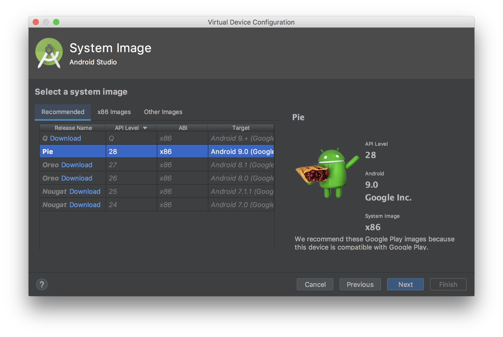
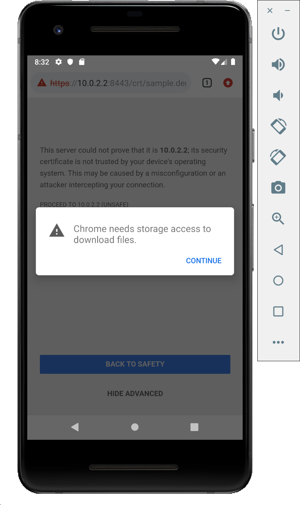

# Amazon Pay モバイル サンプルアプリ Androidアプリの実装について
本サンプルアプリの、Androidアプリ側の実装です。

## 動作環境
Android 7以降: Google Chrome 64以降  
[参考] https://pay.amazon.com/jp/help/202030010

## 概要
本サンプルアプリは、下記動画のように動作いたします。


詳細なフローは、[flow-android.xlsx](./flow-android.xlsx) をご参照下さい。

## インストール方法
先にWebアプリケーション側にあたる、[java](../java/README.md)側をインストールして下さい。

### プロジェクトのOpenとサンプルアプリの起動
本プロジェクトは、[Android Studio(無料)](https://developer.android.com/studio/)で開きます。そのほかのIDEでも開くことはできますが、ここでは上記のIDEでの開き方を説明します。  
まずはAndroid Studioを立ち上げます。  
*※ 下記の画面になっていない場合は、Android Studioで開いているプロジェクトを全て閉じてください。*  

「Import Project」 → cloneしたプロジェクトを選択 → 「Open」  
プロジェクトが開いてGradleのbuildが始まりますので、終わるまで数分お待ちください。  
終了したら、Menuの「Run」→「Run app」か、画面上部の「Run app」ボタンより、applicationを起動してください。

下記のようなapplicationを実行するAndroidデバイス or Virtual Device(Emulatorで起動される、仮想的なAndroidデバイス)を選択する画面が開きます。今回はEmulatorでの起動方法を説明します。  
「Create New Virtual Device」をクリックします。  

今回のサンプルはAPI Level 24 以上で動作しますので、該当するVersionのVirtual Deviceがあればそちらを選択します。
そうでなければ、ここで「Create New Virtual Device」をクリックして、Virtual Deviceを作成します。  

左側の「Category」で「Phone」を選択し、開発に用いたい端末を選択します。  
*※特にこだわりがなければ、デフォルトで選択されているもので構いません。*  
「Next」をクリックします。

API Level 24 から 28のうち好きなものをを選んで、「Next」。  
*※まだDownloadされていない場合には、「Download」より、画面の指示に従ってDownloadしてください。*

「Finish」でVirtual Deviceの生成が開始されますので、数分お待ちください。  
生成が完了すると、生成されたVirtual Deviceが選択できるようになるので、こちらを選択して「OK」。

Emulatorが立ち上がり、サンプルアプリが起動します。(1〜2分かかります。)  


### 自己証明書のインストール
今回のサンプルでは、server側のSSL証明書に自己証明書が使用されているため、サンプルアプリを正しく動作させるためにはその自己証明書をAndroid側にInstallする必要があります。  
ここでは、Emulatorで起動したVirtual DeviceへのInstall方法を説明します。

1. PIN lockの設定  
Androidではセキュリティのため、PINを設定しないとSSL証明書をInstallできません。  
設定画面を開き、セキュリティの設定より「画面のロック(Screen lock)」よりPINを設定してください。  
*※設定画面の開き方や各種設定は、端末やOSのバージョンによっても変わりますので、もし分からなければGoogleなどで検索してお調べください。  
参考までに、代表的な設定画面の開き方としては、アプリ一覧アイコンをクリックして選択する、ホーム画面で下からスワイプしてアプリ一覧を出して選択する、などがあります。*  
  

2. SSL自己証明書のDownload & Install  
Chromeを立ち上げ、下記のURLにアクセスします。  
https://10.0.2.2:8443/crt/sample.der.crt  
下記のように警告が出るので、「ADVANCED」→「PROCEED TO 10.0.2.2(UNSAFE)」  
  
「CONTINUE」  
  
「ALLOW」  
  
「DOWNLOAD」  
  
PINを聞かれるので、先ほど設定した値を入力します。  
表示された証明書Install画面にて、名前の欄に適当な名前を入力し、「VPN and apps」が選択されていることを確認して、「OK」をクリックすればインストール完了です。  
  

あとはEmulator上でサンプルアプリを立ち上げて動作をご確認ください。

## 各要素技術の詳細説明

### WebView ←→ Native間の実装
WebView内のJavaScriptとNativeコード(Java)との間で、お互いの関数を呼び出す機能があるので、こちらを利用しております。  
WebViewを使わないNativeアプリにAmazon PayをIntegrationされる方には、この章は関係ないのでSKIPして下さい。

#### WebView → Nativeの呼び出し
WebView内のJavaScriptから、Nativeコードを呼び出します。

まずはNative側でJavaScriptからの呼び出しをHandleできるように、下記のように「@JavascriptInterface」アノテーションを付与したメソッドを定義します。
```java
// MainActivity.javaから抜粋

    @JavascriptInterface
    public void handle(String secureWebviewSessionId) {
        Log.d("[JsCallback]", secureWebviewSessionId);
        invokeButtonPage(secureWebviewSessionId);
    }
```

次に、WebViewに対して、JavaScriptから「androidApp」という名前でMainActivityのインスタンスにアクセスできるよう、登録します。
```java
// MainActivity.javaから抜粋

        webView.addJavascriptInterface(this, "androidApp");
```

このようにして登録したMainActivityのhandleメソッドは、JavaScriptから下記のように呼び出すことができます。
```js
// cart.htmlの「openAmazonPay」関数から抜粋(見やすくするため、一部加工しています。)

    function openAmazonPay (data) {
        // Android
        androidApp.handle(data.secureWebviewSessionId);
            :
    }
```

#### Native → WebViewの呼び出し
今度はその逆に、Nativeコードから、WebView内のJavaScriptからを呼び出します。   

まずは呼び出される関数を、JavaScript側に実装します。  
```js
// cart.htmlより抜粋
    function purchase(secureWebviewSessionId, accessToken, orderReferenceId) {
        document.getElementById('filter').style.display = 'block';
            :
    }
```

あとは、Native側で下記のように「javascript:」というprefixを付与してJavaScriptのコードをWebViewのloadUrlメソッドに渡すことで、呼び出すことができます。
```swift
// MainActivity.javaから抜粋(見やすくするため、一部加工しています。)
                webView.loadUrl("javascript:purchase('XXXXX', 'YYYYY', 'ZZZZZ')");
```

### Native ←→ Chrome Custom Tabs(Secure WebView)間の実装
Nativeコード(Java)とSecure WebViewの間で、データを伴ってお互いに起動する方法の説明です。  
WebViewを使わないNativeアプリにAmazon PayをIntegrationされる方は、主にこの章をご参照下さい。  

#### Native → Chrome Custom Tabs(Secure WebView)の起動
下記のように起動します。データはURLパラメタとして渡しています。  

```java
// MainActivity.javaから抜粋(見やすくするため、一部加工しています。)

        CustomTabsIntent tabsIntent = new CustomTabsIntent.Builder().build();

        // 起動するBrowserにChromeを指定
        tabsIntent.intent.setPackage("com.android.chrome");

        // 別のActivityへの遷移時に、自動的にChrome Custom Tabsを終了させるためのフラグ設定.
        tabsIntent.intent.addFlags(Intent.FLAG_ACTIVITY_NEW_TASK);
        tabsIntent.intent.addFlags(Intent.FLAG_ACTIVITY_CLEAR_TOP);

        // Chrome Custom Tabs終了時に、Historyとして残らないようにするためのフラグ設定.
        tabsIntent.intent.addFlags(Intent.FLAG_ACTIVITY_NO_HISTORY);

        // Chrome Custom Tabsの起動
        tabsIntent.launchUrl(getApplicationContext(), Uri.parse("https://10.0.2.2:8443/button?secureWebviewSessionId=" + secureWebviewSessionId));
```

なお、Androidでは一度開いたChrome Custom Tabsを後からProgramaticに閉じる方法が知られておらず、そのまま開くと再度Native & の処理を戻したときにもChrome Custom Tabsが残り続けてしまいます。  
そのため、ここでは起動時に、  
「別のActivityが起動したら、自動的に終了する」  
というフラグを設定しています。

#### Chrome Custom Tabs(Secure WebView) → Nativeの起動
ブラウザからアプリを起動できる技術としてはintentがありますが、こちらはintentの定義をコピーされてしまった場合、同じintentで悪意のあるアプリが起動してしまう可能性を完全に排除する方法がないため、センシティブなデータの受け渡しを伴うアプリの起動には不向きです。  

そこで、Applinksという技術を使います。  
こちらは特定のURLのLinkがChrome上でタップされたときに登録されたアプリを起動できる機能なのですが、そのURLとアプリとのMapping情報を自分が管理するServer上に置くことができるため、そのServerがクラックされない限りは悪意のあるアプリが間違って起動されてしまう心配はありません。  
こちらを作成するためのツールが用意されているので、そちらの使い方を説明します。  

「Tool」→「App Links Assistant」を起動します。


起動したApp Links Assistantの①の、「Open URL Mapping Editor」をクリックします。  


「+」より、新しいMappingを追加します。  


「Host」に「https://{定義ファイルを配置する自身が管理するServerのドメイン}」、「Activity」では自分がMappingして起動したいActivityを選択します。  
※ 「Path」を指定することで一つの定義ファイルで複数のActivityとURLのMappingが管理できますが、ここでは説明は割愛します。  


「OK」でAndroidManifest.xmlに次のようなintent-filterが追加されます。  


アプリのインストール時・更新時に自動的にMappingがAndroidによって更新されるよう、下記のように「android:autoVerify="true"」という属性を手動で追加します。


次に②の、「Select Activity」をクリックします。「Insert Code」をクリックすると、選択されたActivityにApplinksからの起動処理を受け取るロジックが追加されます。  


次に③の、「Open Digital Asset Links File Generator」をクリックすると下記が開くので、環境に合わせて適切な値にして「Generate Digital Asset Links file」をクリックします。  


「Save File」ボタンが出てきますので、こちらをクリックすると生成された定義ファイルの「assetlinks.json」を任意のFolderに保存できます。  


定義ファイル「assetlinks.json」をServerに配置します。  
このときの注意点としては、  
  * DomainがWebアプリケーションとは違うサーバーにすること  
  * httpsでファイルにアクセスできること  
  * ファイル取得時のContent-Typeは「application/json」とすること  
  * ファイルは「ドメインのルート/.well-known/」の下に配置すること  

などがあります。  
本サンプルではAWS S3を使用してこの「assetlinks.json」を配置しています。
AWS S3を使うと比較的簡単にできますので、ご参考にして見て下さい。  

定義ファイルの配置が完了したら、「Link and Verify」をクリックしてみて下さい。  
正しく設定できていれば、下のようにダイアログ下部に検証OKのメッセージが出力されます。  


④の「Test App Links」をクリックすると、Emulator上で検証できます。  
下記ダイアログが開くので、「Run Test」ボタンをクリックします。  


Emulator上での検証がOKなら、下記のように検証OKのメッセージが出力されます。


ここまでで、Nativeコードを呼び出す準備が整いました。  
後は「https://{'applinks.json'を配置したサーバーのドメイン}」/...」というURLのLinkをChrome Custom Tabs上でタップすれば、途中で指定したActivityに追加したコードが実行されるはずです。  

参考として、本サンプルの該当するNativeのコードを下記に示します。

```java
        // Applinksからintentを取得
        Intent intent = getIntent();
        String appLinkAction = intent.getAction();
        Uri appLinkData = intent.getData();
        Log.d("[AppLink]", appLinkAction);
        Log.d("[AppLink]", "" + appLinkData);

        //　URLパラメータをparse
        Map<String, String> map = new HashMap<>();
        for (String kEqV : appLinkData.getEncodedQuery().split("&")) {
            String[] kv = kEqV.split("=");
            map.put(kv[0], kv[1]);
        }
```

なお、Applinksが発動する条件はiOSの[Universal Links](https://github.com/amazonpay-labs/amazonpay-mobileapp-sample/tree/master/ios#sfsafariviewcontrollersecure-webview--native%E3%81%AE%E8%B5%B7%E5%8B%95)とよく似ており、基本的には「https://{'apple-app-site-association'を配置したサーバーのドメイン}」/...」というURLのLinkをタップしたときで、JavaScriptなどでこのURLをloadしても起動しません。  
なので、本サンプルでは「ご注文手続き」画面にて、下記のようにCSSを使ってボタンに見せかけた「購入」のリンクをユーザにタップさせることでUniversal Linksを発動し、上記Nativeコードを起動しています。  

```html
<!-- confirm_order.htmlより抜粋(見やすくするため、一部加工しています。) -->
<a id="purchase_link" class="btn btn-info btn-lg btn-block" href="https://amazon-pay-links.s3-ap-northeast-1.amazonaws.com/index.html?secureWebviewSessionId=XXXX&old_secureWebviewSessionId=YYYY&accessToken=ZZZZ&orderReferenceId=S03-8186807-0189293">購　入</a>
```

実験してみたところ、Universal Linksとは違ってRedirectした場合 ( = HTTP 302 が返却されるときのLocationヘッダに「https://{'apple-app-site-association'を配置したサーバーのドメイン}」/...」を指定した場合) には発動するようでした。  

画面のFlowを本サンプルアプリから変更する場合には、こちらのApplinksの制約を頭に入れて設計するようにして下さい。  
