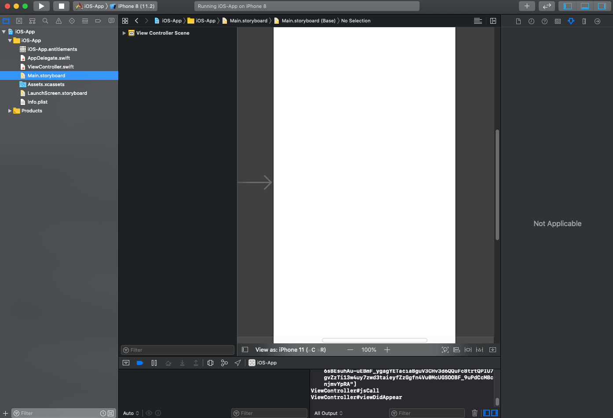
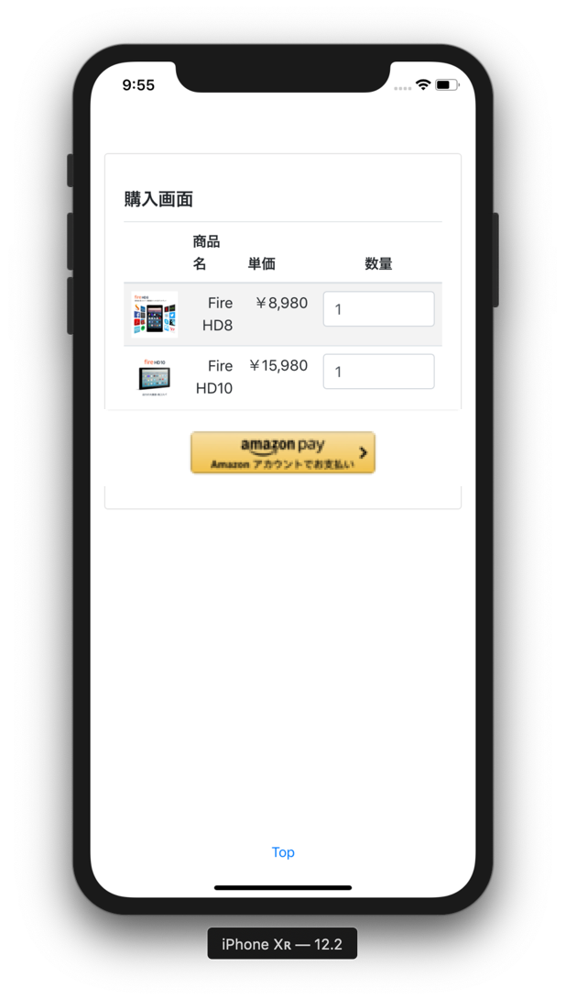
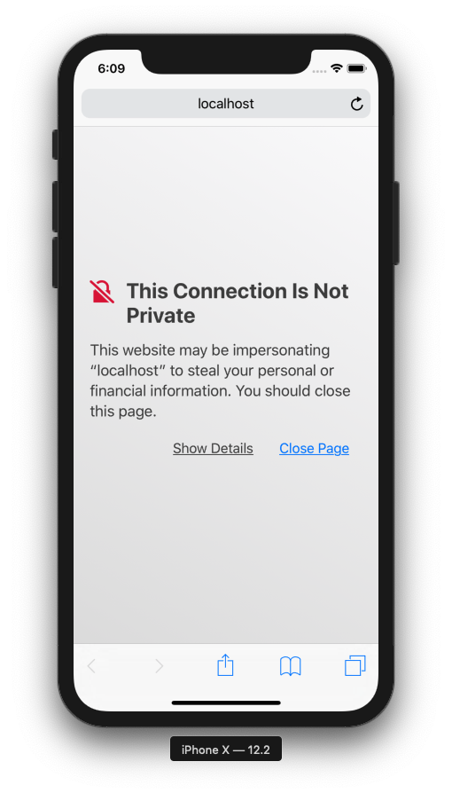
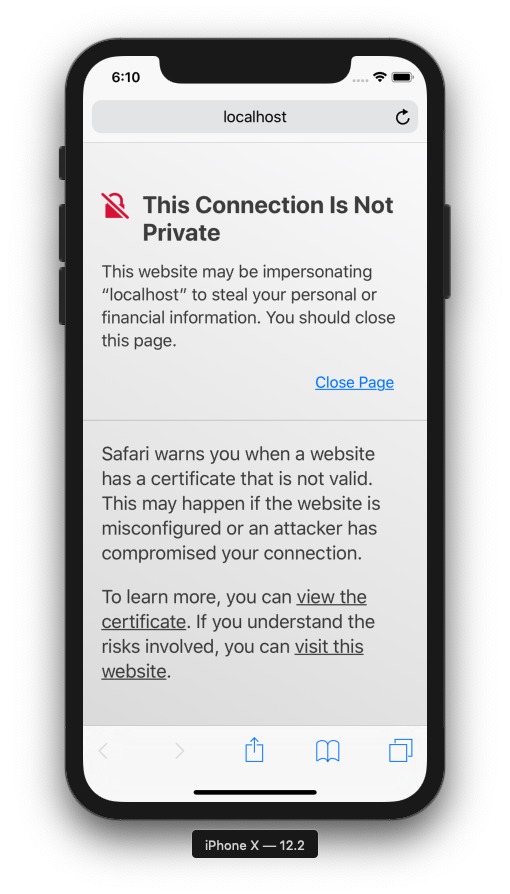
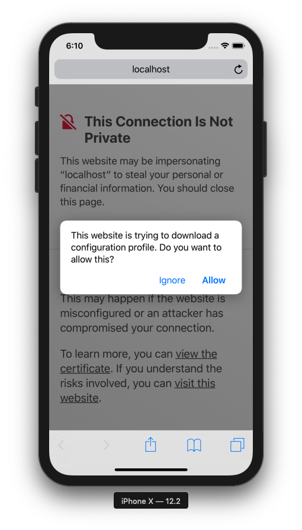
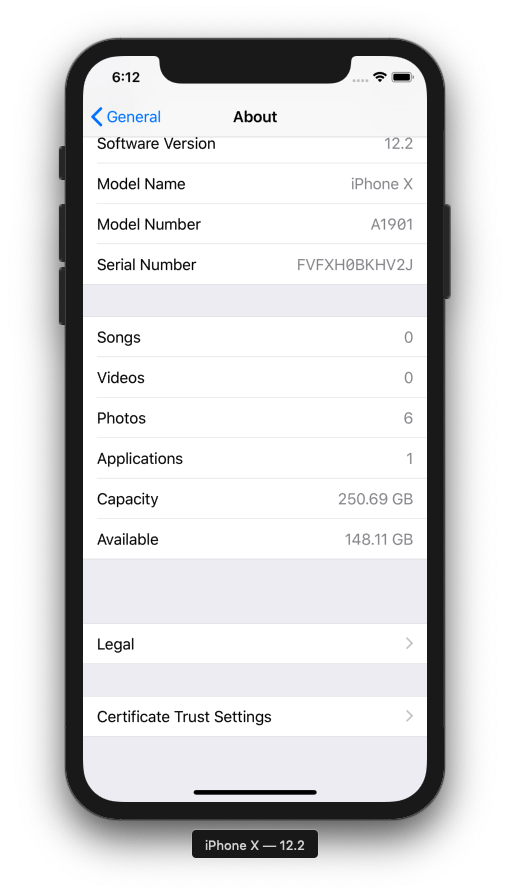
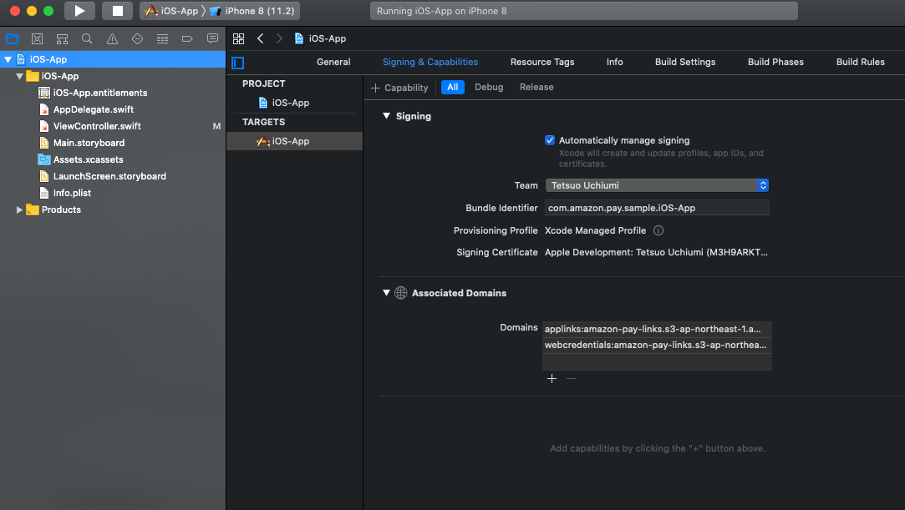

# Amazon Pay モバイル サンプルアプリ iOSアプリの実装について
本サンプルアプリの、iOSアプリ側の実装です。

## 動作環境
iOS バージョン11.2以降: Safari Mobile 11以降  
[参考] https://pay.amazon.com/jp/help/202030010

## その他の前提条件
本サンプルアプリではUniversal Linksという技術を使っており、こちらを利用するためにはAppleにDeveloperとして事前に登録する必要があります。

## 概要
本サンプルアプリは、下記動画のように動作いたします。


詳細なフローは、[flow-ios.xlsx](./flow-ios.xlsx) をご参照下さい。

## インストール方法
先にWebアプリケーション側にあたる、[java](../java/README.md)側をインストールして下さい。

### プロジェクトのOpenとサンプルアプリの起動
本プロジェクトは、Mac上の[Xcode](https://developer.apple.com/jp/xcode/)で開きます。そのほかの環境での開き方は、ここでは扱いません。  
※ ここではversion 10.2.1を使用しています。  
まずはXcodeを立ち上げます。  

「Open another project」で、こちらのios/iOS-Appディレクトリを選択して、「Open」  
プロジェクトが開いたら、Menuの「Product」→「Run」か、画面上部の「Run」ボタンより、applicationを起動してください。

Simulatorが立ち上がり、サンプルアプリが起動します。(1〜2分かかります。)  


### 自己証明書のインストール
今回のサンプルでは、server側のSSL証明書に自己証明書が使用されているため、サンプルアプリを正しく動作させるためにはその自己証明書をiOS側にInstallする必要があります。  
ここでは、起動したSimulatorへのInstall方法を説明します。
※ 以下はiOS12.2で実施しておりますが、iOSのバージョンによっては手順が若干違う場合があります。

1. SSL自己証明書のDownload  
Safariを立ち上げ、下記のURLにアクセスします。(Chrome等の他のブラウザだとうまくいかないことがあるので、必ずSafariをご使用ください。)  
https://localhost:8443/crt/sample.crt  
下記のように警告が出るので、「Show Details」  
  
「visit this website」のリンクをタップし、表示されたダイアログで再度「Visit Website」をタップ  
  
「Allow」をタップし、で開いたダイアログで「Close」をタップ  
  

2. SSL自己証明書のInstall  
Safariを閉じて、「Settings」 →　「General」 → 「Profile」  
今ダウンロードされた「localhost」をタップ  
  
「Install」をタップし、開いたダイアログで再度「Install」をタップ  
  
Installが完了します。  
  

3. SSL自己証明書の有効化  
「Settings」 →　「General」 → 「About」で下記を開いて、「Certificate Trust Settings」  
  
先ほどInstallした「localhost」をONにし、表示されたダイアログで「Continue」をタップして有効化します。  
  

あとはSimulator上でサンプルアプリを立ち上げて動作をご確認ください。

## 各要素技術の詳細説明

### WebView ←→ Native間の実装
WebView内のJavaScriptとNativeコード(Swift/Objective-C)との間で、お互いの関数を呼び出す機能があるので、こちらを利用しております。  
WebViewを使わないNativeアプリにAmazon PayをIntegrationされる方には、この章は関係ないのでSKIPして下さい。

#### WebView → Nativeの呼び出し
WebView内のJavaScriptから、Nativeコードを呼び出します。

まずはNative側でJavaScriptからの呼び出しをHandleできるように、extensionとしてWKScriptMessageHandlerを指定し、userContentControllerメソッドを実装します。
```swift
// ViewController.swiftから抜粋

extension ViewController: WKScriptMessageHandler {
    // JavaScript側からのCallback.
    func userContentController(_ userContentController: WKUserContentController, didReceive message: WKScriptMessage) {
        print("ViewController#userContentController")
        switch message.name {
        case "iosApp":
            print("iosApp")
            
            if let data = message.body as? NSDictionary {
                let secureWebviewSessionId = data["secureWebviewSessionId"] as! String?
                invokeButtonPage(secureWebviewSessionId!)
            }
        default:
            return
        }
    }
}
```

ここでは、「iosApp」という名前でメッセージが送られてきたときに、ViewControllerに実装された「invokeButtonPage」というメソッドを起動しています。

次に、WebViewを生成するとき、JavaScript側が下記のように「iosApp」というMessage Handlerを使用できるよう、Configとして設定します。
```swift
// ViewController.swiftから抜粋

            // JavaScript側からのCallback受付の設定
            let userContentController = WKUserContentController()
            userContentController.add(self, name: "iosApp")
            let webConfig = WKWebViewConfiguration();
            webConfig.userContentController = userContentController
            
            // WebViewの生成、cartページの読み込み
            webView = WKWebView(frame: rect, configuration: webConfig)
```

このようにして登録したJavaScript用のMessage Handler「iosApp」に対しては、下記のようにメッセージを送信できます。
```js
// cart.htmlの「openAmazonPay」関数から抜粋(見やすくするため、一部加工しています。)

    function openAmazonPay (data) {
            :
        webkit.messageHandlers.iosApp.postMessage(data);
            :
    }
```

#### Native → WebViewの呼び出し
今度はその逆に、Nativeコードから、WebView内のJavaScriptからを呼び出します。   

まずは呼び出される関数を、JavaScript側に実装します。  
```js
// cart.htmlより抜粋
    function purchase(secureWebviewSessionId, accessToken, orderReferenceId) {
        document.getElementById('filter').style.display = 'block';
            :
    }
```

あとは、Native側で下記のように「evaluateJavaScript」というWKWebViewのメソッドに呼び出すJavaScriptのコードを渡すことで、呼び出すことができます。
```swift
// ViewController.swiftより抜粋(見やすくするため、一部加工しています。)
            webView.evaluateJavaScript("purchase('XXXXX', 'YYYYY', 'ZZZZZ')", completionHandler: nil)
```

### Native ←→ SFSafariViewController(Secure WebView)間の実装
Nativeコード(Swift/Objective-C)とSecure WebViewの間で、データを伴ってお互いに起動する方法の説明です。  
WebViewを使わないNativeアプリにAmazon PayをIntegrationされる方は、主にこの章をご参照下さい。  

#### Native → SFSafariViewController(Secure WebView)の起動
下記のように起動します。データはURLパラメタとして渡しています。

```swift
// ViewController.swiftから抜粋
        let safariView = SFSafariViewController(url: NSURL(string: "https://localhost:8443/button?secureWebviewSessionId=\(secureWebviewSessionId)")! as URL)
        present(safariView, animated: true, completion: nil)
```

#### SFSafariViewController(Secure WebView) → Nativeの起動
おそらく、ここが一番の難関です。  
ブラウザからアプリを起動できる技術として、CustomURLSchemeというアプリ専用のSchemaを登録してiOSから起動してもらうものがあるのですが、こちらは全く同じSchemaで起動する
悪意のあるアプリを完全に排除する方法がないため、センシティブなデータの受け渡しを伴うアプリの起動には不向きです。  

そこで、Universal Linksというものを使います。  
こちらは特定のURLのLinkがSafari上でタップされたときに登録されたアプリを起動できる機能なのですが、そのURLとアプリとのMapping情報を自分が管理するServer上に置くことができるため、そのServerがクラックされない限りは悪意のあるアプリが間違って起動されてしまう心配はありません。  

まずは、URLとアプリとのMappingを行うJSONファイルを作成します。  

```json
{
    "applinks": {
        "apps": [],
        "details": [
            {
                "appID":"XXXXXXXX.com.amazon.pay.sample.amazonpay-ios",
                "paths":[ "*" ]
            }
        ]
    }
}
```

こちらのJSONファイル内の「appID」は、"{TeamID}.{Bundle Identifier}"で構成されます。  
TeamIDは、ご自身のAppleアカウントでApple Developer Centerにログインし、「Membership」→ 「Team ID」で確認できます。  
またBundle Identifierは、Xcodeで設定の「General」「Signing & Capabilities」等で確認できます。  

こうして作成したファイルは、「apple-app-site-association」という名前で保存します。   

この「apple-app-site-association」を、自身が管理するServerに配置します。  
このときの注意点としては、  
  * DomainがWebアプリケーションとは違うサーバーにすること  
  * httpsでファイルにアクセスできること  
  * ファイル取得時のContent-Typeは「application/json」とすること  
  * ファイルはドメインのルート or 「ドメインのルート/.well-known/」の下に配置すること  

などがあります。  
[こちら](https://dev.classmethod.jp/articles/universal-links/)の方のように、AWS S3を使うと比較的簡単にできますので、ご参考にして見て下さい。  
※ 本サンプルでも、AWS S3を使って「apple-app-site-association」を配置しております。  

そしてAssociated Domainsを追加します。  
Xcodeで「Signing & Capabilities」を開き、左上の「+ Capability」から「Associated Domains」を追加します。  
※ この操作により、Apple Developer Centerで「Certificates, Identifiers & Profiles」→ 「Identifiers」にアプリのBundle Identifierが自動的に登録されます。  

  

こうして表示されたAssociated Domainsに、上記画像のように下記二つを登録します。
  * applinks:{上記「apple-app-site-association」を配置したサーバーのドメイン}  
  * webcredentials:{上記「apple-app-site-association」を配置したサーバーのドメイン}  

ここまでで、Nativeコードを呼び出す準備が整いました。  
後は「https://{'apple-app-site-association'を配置したサーバーのドメイン}」/...」というURLのLinkをSFSafariViewController上でタップすれば、AppDelegate.swiftに追加した下記のコードが実行されるはずです。

```swift
// AppDelegate.swiftより抜粋
    func application(_ application: UIApplication, continue userActivity: NSUserActivity, restorationHandler: @escaping ([UIUserActivityRestoring]?) -> Void) -> Bool {
        print("Universal Links!")
        if userActivity.activityType == NSUserActivityTypeBrowsingWeb {
            print(userActivity.webpageURL!)
                :
        }
        return true;
    }
```

Note: 上記はSwift5の場合。Swift4以前の場合は下記。
```swift
    func application(_ application: UIApplication, continue userActivity: NSUserActivity, restorationHandler: @escaping ([Any]?) -> Void) -> Bool {
        print("Universal Links!")
        if userActivity.activityType == NSUserActivityTypeBrowsingWeb {
            print(userActivity.webpageURL!)
                :
        }
        return true;
    }
```

なお、こちらのUniversal Linksにより上記コードが起動するのは、上にも書いたとおり「https://{'apple-app-site-association'を配置したサーバーのドメイン}」/...」というURLのLinkをタップしたときだけで、JavaScriptなどでこのURLをloadしても起動しません。
なので、本サンプルでは「ご注文手続き」画面にて、下記のようにCSSを使ってボタンに見せかけた「購入」のリンクをユーザにタップさせることでUniversal Linksを発動し、上記Nativeコードを起動しています。

```html
<!-- confirm_order.htmlより抜粋(見やすくするため、一部加工しています。) -->
<a id="purchase_link" class="btn btn-info btn-lg btn-block" href="https://amazon-pay-links.s3-ap-northeast-1.amazonaws.com/index.html?secureWebviewSessionId=XXXX&old_secureWebviewSessionId=YYYY&accessToken=ZZZZ&orderReferenceId=S03-8186807-0189293">購　入</a>
```

画面のFlowを本サンプルアプリから変更する場合には、こちらのUniversal Linksの制約を頭に入れて設計するようにして下さい。
