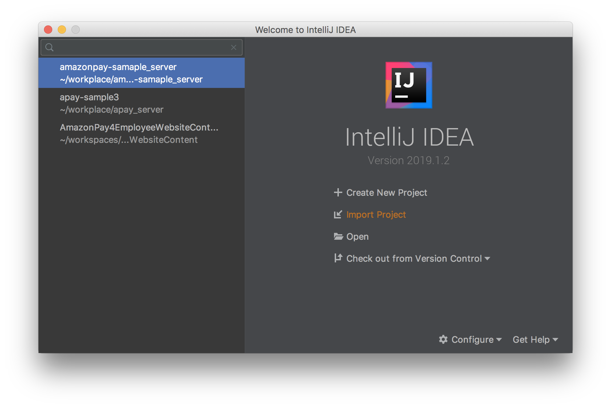
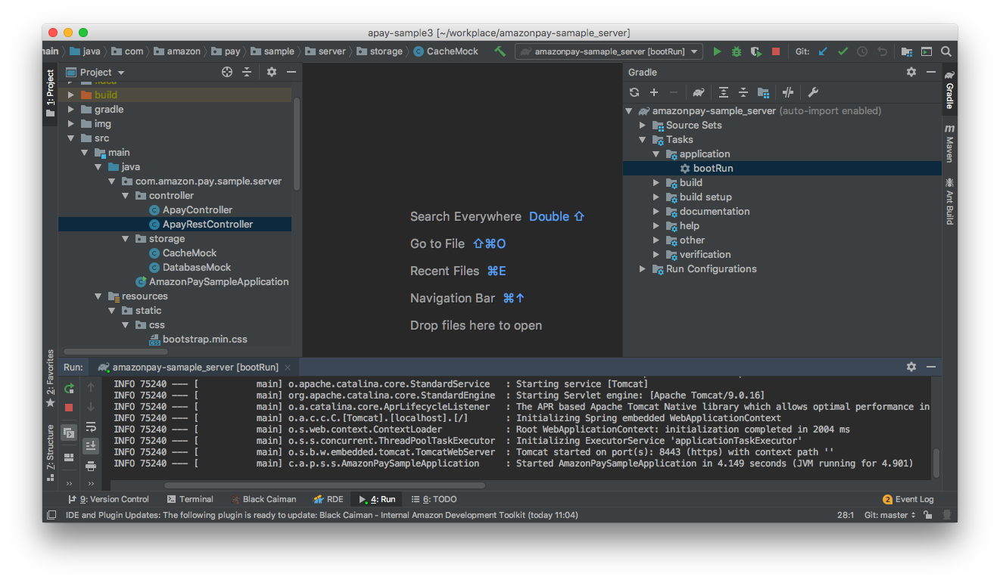
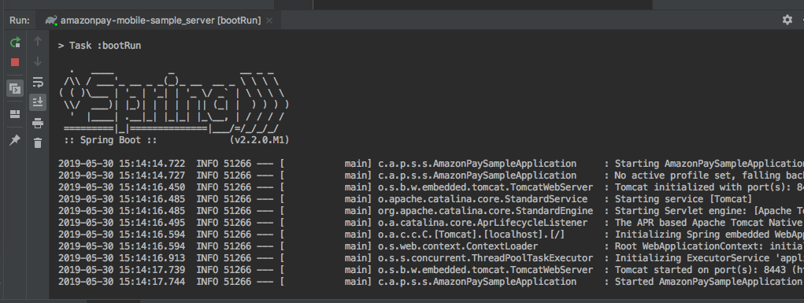
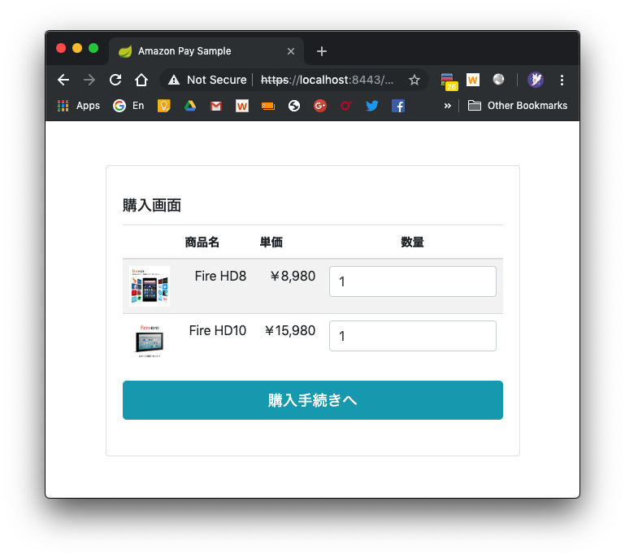

# Amazon Pay モバイル サンプルアプリ Webアプリケーション側の実装について
本サンプルアプリ全体の、Webアプリケーション側の実装です。

## 動作環境
JavaSDK： Java 8 以上  
Framework: Spring Boot 2.2.0M & Thymeleaf 3.0.11  

## 概要
本Webアプリケーションでは、下記の処理を行っております。
  * WebView・Secure WebViewからのrequest受付・画面の出力 及び 画面遷移
  * アプリとSecure WebView共通で使えるSession情報として、Secure WebView Sessionの管理とデータの保持  

Secure WebView Sessionは「secureWebviewSessionId」というIDをアプリ側・Secure WebView側に受け渡すことで実現しており、お互いにデータをやり取りするために使用します。  
より詳細な動作については、[android](../android/README.md)、[ios](../ios/README.md)のflow図や、コードをご参照下さい。

# server側のインストール

## リポジトリのclone
もしまだであれば、まずは本リポジトリをcloneして下さい。  
```
git clone https://github.com/amazonpay-labs/amazonpay-mobileapp-sample.git
```
cloneされてできたディレクトリの下の「java」ディレクトリの下が、こちらのWebアプリケーションのプロジェクトになります。  

## プロジェクトのopen
cloneしてきたjavaディレクトリのプロジェクトは、[Intellij IDEA Community(無料)](https://www.jetbrains.com/idea/download/)で作成されています。そのほかのIDEでも開くことはできますが、ここでは上記のIDEでの開き方を説明します。  
Intellijをまだインストールされていない方は、上記のリンク先よりダウンロードしてインストールするか、パッケージマネージャの利用が可能ならそちらからインストールするかしてください。

インストールしたら、まずはIntellijを立ち上げます。  
*※ 下記の画面になっていない場合は、Intellijで開いているプロジェクトを全て閉じてください。*  

「Import Project」 → cloneしたディレクトリ下のjavaディレクトリを選択 → 「Open」 → 「Import project from external model」「Gradle」を選んで、「Next」 →　「Finish」  
プロジェクトが開いてGradleのbuildが始まりますので、終わるまで数分お待ちください。  

## Seller Centralへの新しいアプリケーション作成とリダイレクトURLの登録
[Seller Central](https://sellercentral.amazon.co.jp/)にて、本サンプル用に新しいアプリケーションを登録します。
登録したアプリケーションのウェブ設定より、JavaScriptの種類とリダイレクトURLを下記のように設定します。
- JavaScriptの種類
  - https://localhost:8443
  - https://10.0.2.2:8443
- リダイレクトURL
  - https://localhost:8443/confirm_order
  - https://10.0.2.2:8443/confirm_order

Note: IPアドレスの「10.0.2.2」とは、PCと接続したAndroidデバイス＆Android EmulatorからPCの「localhost」環境にアクセスするための特殊なアドレスです。

## merchant.propertiesの設定
クライアントID、出品者ID、アクセスキーID、シークレットアクセスキーを、merchant.propertiesファイルに設定します。  
merchant.propertiesは「./src/main/resources」の下に置く必要がありますが、この時点ではまだ配置されていません。  
プロジェクトのroot directory直下に雛形の「merchant.properties」が置いてあるので、こちらを上記「./src/main/resources」の下にコピーします。  
コピーしたファイルを開くと、中は下記のようになっています。
```
client.id=amzn1.application-xxx-xxxxxx.xxxxxxxxxxxxxxxxxxxxxxxxxxxxxxxx
seller.id=XXXXXXXXXXXXXX
access.key=XXXXXXXXXXXXXXXXXXXX
secret.key=XXXXXXXXXXXXXXXXXXXXXXXXXXXXXXXXXXXXXXXX
```
ご自身の保有する[Seller Central](https://sellercentral.amazon.co.jp/)のアカウントのページより、上記それぞれのクライアントID、出品者ID、アクセスキーID、シークレットアクセスキーを入力して、保存してください。  
なお、ここで編集した「./src/main/resources/merchant.properties」は、「.gitignore」という仕組みを用いてgitには登録されないよう設定されています。よってこちらはcommitもpushもされませんので、入力した内容が漏洩することはありません。

## https通信用の自己証明書の生成
[こちら](ssl/README.md)を参考に、https通信用の秘密鍵・自己証明書を作成。  

## bootRunによるserverの起動
Gradle Viewを開いて「Tasks」 →　「application」 →　「bootRun」より起動してください。  
※ Gradle Viewが表示されていない場合は、メニューの「View」→「Tool Window」→「Gradle View」からOpenしてください。


下記のようなログが表示されれば無事に起動しています。  


試しに、https://localhost:8443/browser/cart にアクセスしてみてください。セキュリティの警告が出ますが、無視して進めると下記画面が表示されるはずです。  


なお、本サンプルアプリはPC上のブラウザでも動作しますので、アプリの動作の確認や挙動の理解にご活用ください。

## Security上の注意点
本サンプルアプリでは、アプリ側とSecure WebView側でのデータのやり取りのため、secureWebviewSessionという名前のSessionを導入しています。  
これを管理するためのIDとして、secureWebviewSessionIdというのをWebアプリケーション側で生成しています。  

この生成部分のコードが下記になります。  
```java
    /**
     * secureWebviewSessionアクセス用のsecureWebviewSessionIdを生成する.
     * session IDは推測困難であることが求められるので、下記の要件を満たす必要がある.
     * <ul>
     *     <li>暗号論的に強度の高い擬似乱数生成器により生成された乱数部分を含んでいる</li>
     *     <li>上記乱数部分の桁数が十分な長さである.(※一般的なSession IDの実装で128bit前後)</li>
     * </ul>
     * ここで採用しているUUID v4のJDKによる実装は上記を満たしている.
     *   参考: https://docs.oracle.com/javase/jp/8/docs/api/java/util/UUID.html#randomUUID--
     * もし別の実装を採用する場合には、上記を満たしているか確認すること.<br/>
     * Note: UUID v4の乱数部分の仕様では、生成に暗号論的な強度が十分な乱数を使うことを推奨しているものの、
     * 規定はしていない.
     *   参考: https://tools.ietf.org/html/rfc4122#section-4.4
     * つまり実装によっては推測可能な乱数生成方法を採用している可能性もある. よって、JDK以外のUUID v4の
     * 実装の採用を検討する場合には乱数生成の暗号論的な強度が十分かを確認すること.
     * @return 新しいsecureWebviewSessionId
     */
    public static String createToken() {
        return UUID.randomUUID().toString();
    }
```

少々コメントの内容が難しいですが、要するにSession IDを採番するときには、Security上推奨されているやり方に則って採番する必要がある、ということです。  
推奨の方法は各プログラミング言語やFrameworkによっても違いますので、注意して実装してください。
